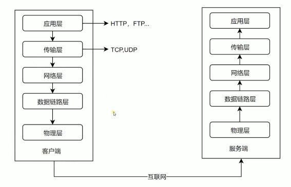
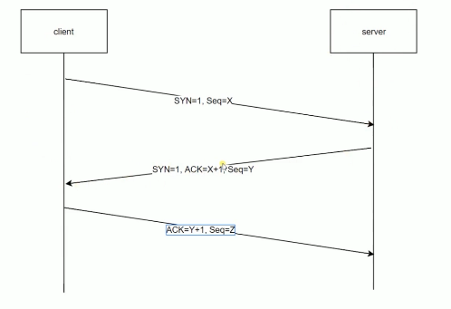
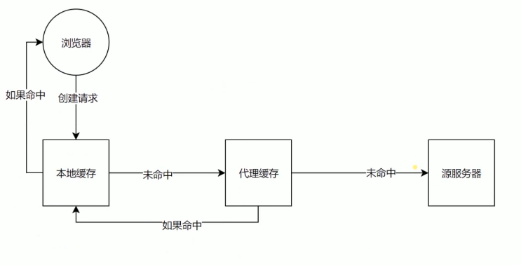
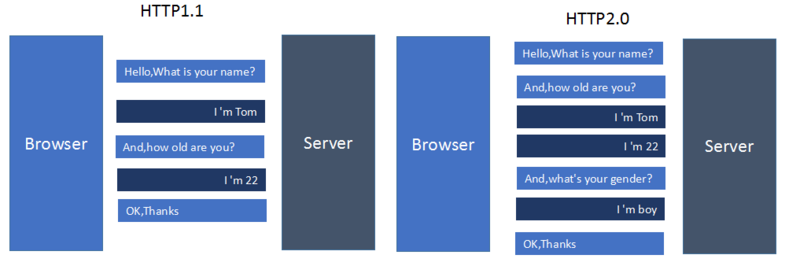

## 经典的五层模型



低三层

- 物理层主要作用是定义物理设置如何传输数据
- 数据链路层在通信的实体间建立数据链路连接
- 网络层为数据在结点之间传输创建逻辑链路

传输层

- 向用户提供可靠的端到端(End-to-End)服务
- 传输层向高层屏蔽了下层的数据通信的细节

应用层

- 为应用软件提供了很多服务
- 构建于 TCP 协议之上
- 屏蔽网络传输相关细节

## http协议的发展历史

HTTP/0.9

- 只有一个命令 GET
- 没有HEADER等描述数据的信息
- 服务器发送完毕，就关闭 TCP 连接

HTTP/1.0

- 增加了很多命令
- 增加 status code 和 header
- 多字符集支持、多部分发送、权限、缓存等

HTTP/1.1

- 持久连接
- pipeline
- 增加 host 和其他一些命令

HTTP2

- 所有数据以二制传输
- 同一个连接里面发送多个请求不再需要按照顺序来
- 头信息压缩及推送等提高效率的功能

HTTP 的三次握手



第一次握手：主机 A 发送位码为 syn = 1,随机产生seq number=1234567的数据包到服务器，主机 B 由 syn=1知道， A要求建立联机。

第二次握手：主机B收到请求后要确认联机信息，向A发送ack number=(主机A的seq+1),syn=1,ack=1,随机产生seq=7654321的包。

第三次握手：主机A收到后检查ack number是否正确，即第一次发送的seq number+1,以及位码ack是否为1，若正确，主机A会再发送ack number=(主机B的seq+1),ack=1，主机B收到后确认seq值与ack=1则连接建立成功。

## CORS 解决浏览器跨域限制

什么是 CORS

CORS（Cross-Origin Resource Sharing 跨源资源共享），当一个请求url的协议、域名、端口三者之间任意一与当前页面地址不同即为跨域。

CORS是解决浏览器跨域限制的W3C标准，详见：https://www.w3.org/TR/cors/。

根据 CORS 标准的定义，在浏览器中访问跨域资源时，需要做如下实现：

- 服务端在响应消息头中包含消息头：Access-Control-Allow-Origin,值为服务器允许访问资源的域名称，同时浏览器会根据该值与发起的请求消息头 Origin值进行匹配，以确认服务端是否允许访问跨域资源。
- 浏览器在发送非“简单方法” (GET,HEAD请求被定义为简单方法)之前，会发送一个预检请求（通常是一个 OPTIONS请求），浏览器根据响应消息验证服务端是否允许访问跨域资源，从而决定是否需要发送"实际请求"。
- 在服务端根据请求消息头Origin值以决定是否允许浏览器访问跨域资源，返回相应的消息头

具体来说，在实现时通常需要设置如下几个响应消息头：

1. Access-Control-Allow-Origin：“origin-list” | “null” | “*”，允许访问跨域资源的域名列表，对于预检请求来说，决定是否会发送实际请求。
2. Access-Control-Allow-Credentials：true | false，表明实际请求中是否可以包含用户凭证信息。
3. Access-Control-Allow-Methods：“method”，服务端允许访问的实际请求方法名列表。
4. Access-Control-Allow-Headers：“field-name”，在“实际”请求中可以包含的消息头名称列表。
5. Access-Control-Max-Age：seconds，预检请求结果缓存时间，单位：秒。在该时间范围内，发送实际请求之前不再会发送预检请求。

## HTTP 缓存 Cache-Control头域

Cache-Control指定请求和响应遵循的缓存机制。在请求消息或响应消息中设置Cache-Control并不会修改另一个消息处理过程中的缓存处理过程。请求时的缓存指令包括no-cache、no-store、max-age、max-stale、min-fresh、only-if-cached，响应消息中的指令包括public、private、no-cache、no-store、no-transform、must-revalidate、proxy-revalidate、max-age。各个消息中的指令含义如下：

Public指示响应可被任何缓存区缓存。

- Private指示对于单个用户的整个或部分响应消息，不能被共享缓存处理。这允许服务器仅仅描述当用户的部分响应消息，此响应消息对于其他用户的请求无效。
- no-cache指示请求或响应消息不能缓存
- no-store用于防止重要的信息被无意的发布。在请求消息中发送将使得请求和响应消息都不使用缓存。
- max-age指示客户机可以接收生存期不大于指定时间（以秒为单位）的响应。
- min-fresh指示客户机可以接收响应时间小于当前时间加上指定时间的响应。
- max-stale指示客户机可以接收超出超时期间的响应消息。如果指定max-stale消息的值，那么客户机可以接收超出超时期指定值之内的响应消息。

> Cache-Control: no-cache：这个很容易让人产生误解，使人误以为是响应不被缓存。实际上Cache-Control：no-cache是会被缓存的，只不过每次在向客户端（浏览器）提供响应数据时，缓存都要向服务器评估缓存响应的有效性。
> Cache-Control: no-store：这个才是响应不被缓存的意思

## HTTP 缓存 ETAG 和 Last-Modified 资源验证

缓存是如何操作的：



浏览器创建了一个请求，首先到达的地方是本地缓存（这个是前提是你开启 Cache-Control 缓存）， 如果命中，就直接返回给浏览器，如果没有命中 就会往互联网进行发送，在发送过程中有可能进入代理缓存，如果命中 经过本地缓存返回给浏览器，如果没有命中才会真正到源服务器，这个就是从浏览器发出一个请求到查找缓存的一个过程。

本地缓存文件通常是有过期时间（Http协议头中的expire字段）的，一旦过期，需要从新向服务端发起请求，此时通常会有两种情况：

- 服务器的文件或者内容没有更新，可以继续使用浏览器本地缓存
- 服务器的文件或者内容已经更新，需要重新请求，通过网络传输新的文件或者内容

如何判断文件的内容是否过期，可以通过HTTP协议来控制。请求服务器时，比对Last-Modified或Etag来判断内容是否发生变化，它们都是上一次请求是服务端生成并返回给浏览器的，缓存过期后再次请求时，会把它们包含在HTTP请求中和服务端进行比对，如果比对一致，说明内容没有变更，服务器会返回 304 Not Modified，否则重新发起资源请求，这样的话，就不需要每次访问服务器都通过网络传输一个比较大的文件或者数据包，只要简单的http应答就可以达到相同的请求文件效

什么是Last-Modified

在浏览器第一次请求某一个URL时，服务器端的返回状态会是200，内容是你请求的资源，同时有一个Last-Modified的属性标记此文件在服务期端最后被修改的时间，格式类似这样：

```
Last-Modified: Fri, 12 May 2006 18:53:33 GMT
```

客户端第二次请求此URL时，根据 HTTP 协议的规定，浏览器会向服务器传送 If-Modified-Since 报头，询问该时间之后文件是否有被修改过：

```
If-Modified-Since: Fri, 12 May 2006 18:53:33 GMT
```
如果服务器端的资源没有变化，则自动返回 HTTP 304 （Not Changed.）状态码，内容为空，这样就节省了传输数据量。 当服务器端代码发生改变或者重启服务器时，则重新发出资源，返回和第一次请求时类似。从而保证不向客户端重复发出资源，也保证当服务器有变化时，客户端能 够得到最新的资源。

什么是 Etag

HTTP 协议规格说明定义ETag为“被请求变量的实体值”。另一种说法是，ETag是一个可以与Web资源关联的记号（token）。典型的Web资源可以一个Web页，但也可能是JSON或XML文档。服务器单 独负责判断记号是什么及其含义，并在HTTP响应头中将其传送到客户端，以下是服务器端返回的格式：

```
ETag: "50b1c1d4f775c61:df3"
```

客户端的查询更新格式是这样的：

```
If-None-Match: W/"50b1c1d4f775c61:df3"
```

如果ETag没改变，则返回状态304然后不返回，这也和Last-Modified一样。本人测试Etag主要在断点下载时比较有用。

Last-Modified和Etags如何帮助提高性能?

聪明的开发者会把Last-Modified 和ETags请求的http报头一起使用，这样可利用客户端（例如浏览器）的缓存。因为服 务器首先产生 Last-Modified/Etag标记，服务器可在稍后使用它来判断页面是否已经被修改。本质上，客户端通过将该记号传回服务器要求服 务器验证其（客户端）缓存。

1. 客户端请求一个页面（A）。
2. 服务器返回页面A，并在给A加上一个Last-Modified/ETag。
3. 客户端展现该页面，并将页面连同Last-Modified/ETag一起缓存。
4. 客户再次请求页面A，并将上次请求时服务器返回的Last-Modified/ETag一起传递给服务器。
5. 服务器检查该Last-Modified或ETag，并判断出该页面自上次客户端请求之后还未被修改，直接返回响应304和一个空的响应体。

## HTTPS

HTTPS是以安全为目标的HTTP通道，简单讲是HTTP的安全版，即HTTP下加入SSL层，HTTPS的安全基础是SSL，因此加密的详细内容就需要SSL。

HTTPS协议的主要作用可以分为两种：一种是建立一个信息安全通道，来保证数据传输的安全；另一种就是确认网站的真实性。

HTTP与HTTPS有什么区别

HTTP协议传输的数据都是未加密的，也就是明文的，因此使用HTTP协议传输隐私信息非常不安全，为了保证这些隐私数据能加密传输，于是网景公司设计了SSL（Secure Sockets Layer）协议用于对HTTP协议传输的数据进行加密，从而就诞生了HTTPS。简单来说，HTTPS协议是由SSL+HTTP协议构建的可进行加密传输、身份认证的网络协议，要比http协议安全。

HTTPS和HTTP的区别主要如下：

1. https协议需要到ca申请证书，一般免费证书较少，因而需要一定费用。
2. http是超文本传输协议，信息是明文传输，https则是具有安全性的ssl加密传输协议。
3. http和https使用的是完全不同的连接方式，用的端口也不一样，前者是80，后者是443。
4. http的连接很简单，是无状态的；HTTPS协议是由SSL+HTTP协议构建的可进行加密传输、身份认证的网络协议，比http协议安全。

## HTTP2.0

HTTP2.0的新特性

- 新的二进制格式（BinaryFormat），HTTP1.x的解析是基于文本。基于文本协议的格式解析存在天然缺陷，文本的表现形式有多样性，要做到健壮性考虑的场景必然很多，二进制则不同，只认0和1的组合。基于这种考虑HTTP2.0的协议解析决定采用二进制格式，实现方便且健壮。
- 多路复用（MultiPlexing），即连接共享，即每一个request都是是用作连接共享机制的。一个request对应一个id，这样一个连接上可以有多个request，每个连接的request可以随机的混杂在一起，接收方可以根据request的id将request再归属到各自不同的服务端请求里面。
- header压缩，如上文中所言，对前面提到过HTTP1.x的header带有大量信息，而且每次都要重复发送，HTTP2.0使用encoder来减少需要传输的header大小，通讯双方各自cache一份headerfields表，既避免了重复header的传输，又减小了需要传输的大小。
- 服务端推送（server push），同SPDY一样，HTTP2.0也具有server push功能。目前，有大多数网站已经启用HTTP2.0，例如YouTuBe，淘宝网等网站

关于HTTP2和HTTP1.x的区别大致可以看下图：

